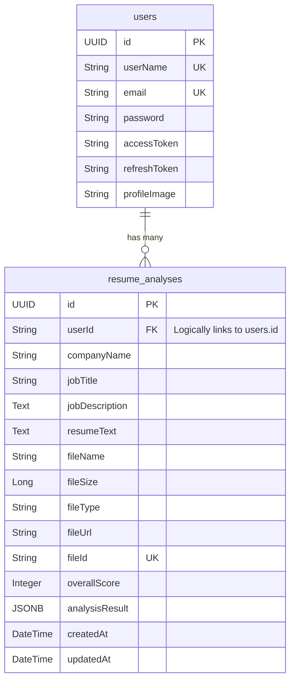

# Resume Analyzer

A full-stack, AI-powered web application designed to analyze resumes against job descriptions, providing skill matching, scoring, and actionable feedback. The project is structured as a monorepo, maintaining clear separation of concerns between the frontend client and backend API.

## 🏗️ Project Architecture

The repository is divided into two decoupled layers:

- **`Resume-Analyzer/`**: The Spring Boot Backend (REST API)
- **`frontend_next/`**: The Next.js Frontend (Client UI)

---

## 🖥️ Frontend Architecture (`frontend_next`)

The frontend is a modern Single Page Application (SPA) with Server-Side Rendering (SSR) capabilities built with Next.js. It focuses on a clean, responsive, and interactive user experience.

### Technologies Used
- **Framework:** Next.js 16 (App Router paradigm), React 19
- **Styling:** Tailwind CSS v4 for utility-first styling, Radix UI for accessible base components.
- **Animations:** `framer-motion` for smooth, dynamic UI transitions.
- **State Management & Fetching:** Redux Toolkit (`@reduxjs/toolkit`) for global state and React Query (`@tanstack/react-query`) for asynchronous data fetching and caching.
- **Form Handling:** `react-hook-form` paired with `yup` and `zod` for robust schema validation.
- **Data Visualization:** `recharts` for rendering interactive charts (e.g., skill radar charts).
- **PDF Processing:** Natively parses uploaded PDFs in the browser using `pdf-parse` and `pdfjs-dist`.

### Key User Flows
1. **Authentication:** Users can register and log in securely. Sessions are maintained via JWT tokens.
2. **Resume Upload:** Users upload a PDF resume and paste a Job Description.
3. **Analysis Dashboard:** The application displays a match score, keyword analysis, and visual charts comparing the resume to the job requirements.

---

## ⚙️ Backend Architecture (`Resume-Analyzer`)

The backend is a robust REST API built with Java and Spring Boot. It handles business logic, security, data persistence, and integration with the database.

### Technologies Used
- **Framework:** Spring Boot 3.x/4.x (WebMVC, Security, Data JPA, Validation)
- **Language:** Java 17
- **Database:** PostgreSQL for relational data storage.
- **Authentication:** Stateless JWT (JSON Web Tokens) using the `jjwt` library. Passwords are encrypted using BCrypt.
- **Utilities:** Lombok to reduce boilerplate code (Getters, Setters, Builders).

### Security Flow
- **Registration:** Passwords are hashed and stored. A JWT access token and refresh token are generated and saved.
- **Login:** The user is authenticated via Spring Security's `AuthenticationManager`. Upon success, new tokens are issued.
- **Authorization:** Protected endpoints require a valid Bearer JWT in the `Authorization` header, validated by a custom `JwtAuthFilter`.

---

## 🗄️ Database Structure & Schema

The application uses **PostgreSQL** to store user information and their historical resume analyses. The database is designed relationally with JSONB support for dynamic data.

### Entity Relationship Diagram

### Table Details

#### 1. `users` Table
Stores authentication and profile information.
- **`id`**: Primary Key (UUID).
- **`userName`, `email`**: Unique identifiers for login.
- **`password`**: BCrypt hashed password.
- **`accessToken`, `refreshToken`**: Stores active session tokens.
- **`profileImage`**: URL or path to the user's avatar.

#### 2. `resume_analyses` Table
Stores the results of every resume analyzed by the user.
- **`id`**: Primary Key (UUID).
- **`userId`**: Foreign key linking to the `users` table.
- **`companyName`, `jobTitle`, `jobDescription`**: The target job context.
- **`resumeText`**: The extracted raw text from the parsed PDF.
- **`fileName`, `fileSize`, `fileType`, `fileUrl`, `fileId`**: Metadata for the uploaded file (often linked to cloud storage like ImageKit/S3).
- **`overallScore`**: The computed integer match score (0-100).
- **`analysisResult`**: A dynamic **JSONB** column storing complex analysis data (e.g., missing skills, matched keywords, recommendations) without requiring rigid schema updates.
- **`createdAt`, `updatedAt`**: Audit timestamps managed automatically by JPA `@PrePersist` and `@PreUpdate` hooks.

---

## 🚀 Setup & Running Locally

### 1. Database Setup
Ensure PostgreSQL is running. Create a database named (e.g., `resume_analyzer_db`). The Spring Boot application (via Hibernate) will automatically create the tables defined above.

### 2. Run the Backend
1. Navigate to the backend directory: `cd Resume-Analyzer`
2. Update your `application.properties` with your DB credentials.
3. Build and run: `mvn spring-boot:run`
4. The API runs on `http://localhost:8080` (or `8081`).

### 3. Run the Frontend
1. Navigate to the frontend directory: `cd frontend_next`
2. Install dependencies: `npm install`
3. Start the dev server: `npm run dev`
4. Access the UI at `http://localhost:3000`
